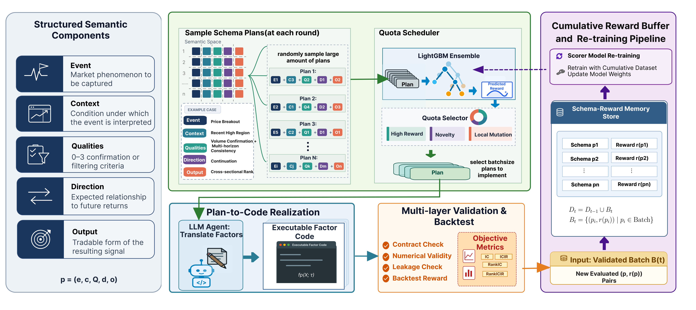

# AlphaSchema

**面向可执行量化因子的结构化语义搜索。**

[English](README.md) | [简体中文](README_zh-CN.md)

AlphaSchema 将因子挖掘视为对结构化语义计划的搜索，而不是无约束的代码生成。每个计划描述一个市场事件、事件发生的情境、可选的质量条件、交易方向上的解释，以及信号最终采用的数值形式。

在挖掘过程中，系统会在探索新的 schema 组合、利用高潜力区域以及变异历史优秀计划之间进行调度。Code Agent 将语义计划转化为可执行的因子代码；随后，验证与回测模块返回奖励和诊断信息，并用这些反馈引导后续搜索。

[](docs/assets/method.pdf)

本仓库提供核心挖掘流程、英文 schema 库、Agent prompts、配置示例和可直接运行的轻量级演示。市场数据、内部实验记录和 API 凭证不包含在仓库中。

## 快速开始

AlphaSchema 需要 Python 3.10 或更高版本。

```bash
git clone git@github.com:JingyangYi/AlphaSchema.git
cd AlphaSchema
pip install -e .
python examples/run_demo.py
```

演示使用仓库内置的轻量级后端，不依赖私有数据或 LLM API。

使用自己的数据和兼容 OpenAI 接口的模型运行挖掘任务：

```bash
export LLM_API_KEY="your-api-key"

alphaschema validate-data --config configs/default_stock_search.json
alphaschema run --config configs/default_stock_search.json
```

用户需要准备经过复权的日频市场数据，并在 [`configs/default_stock_search.json`](configs/default_stock_search.json) 中设置数据路径和字段映射。搜索策略、批量大小、模型接口、验证规则和奖励设置均可通过该配置调整。

## 仓库结构

```text
AlphaSchema/
├── alphaschema/                 # 搜索、代码生成、验证与日志记录的核心实现
│   ├── workflow.py              # 端到端挖掘流程
│   ├── selector.py              # 探索、利用与变异选择
│   ├── code_agent.py            # 将语义计划转化为因子代码
│   ├── validation.py            # 实现有效性与信息泄漏检查
│   ├── backend.py               # 因子评估接口
│   ├── reward_model.py          # 奖励预测与反馈
│   └── records.py               # 逐计划实验记录
├── configs/                     # 搜索与数据配置
├── schemas/stock_alpha/         # Event、Context、Quality、Direction 和 Output schemas
├── prompts/                     # Agent 使用的英文 prompts
├── examples/                    # 最小演示与评估后端模板
├── tests/                       # 核心流程测试
└── pyproject.toml               # Python 包信息与依赖
```

## 挖掘产物

系统会为每个实际运行的计划记录完整的 schema 组成、selector 来源、预测奖励、实际奖励、评估指标、生成的因子代码和验证状态。同时，系统也会在配置的输出目录中保存运行摘要与奖励变化轨迹，因此无需单独部署 UI 也可以检查完整的搜索过程。

## 项目范围

AlphaSchema 提供的是因子挖掘的核心机制，而不是封装完整的研究环境。用户需要自行提供市场数据、评估后端、模型接口以及与具体实验相关的配置。
